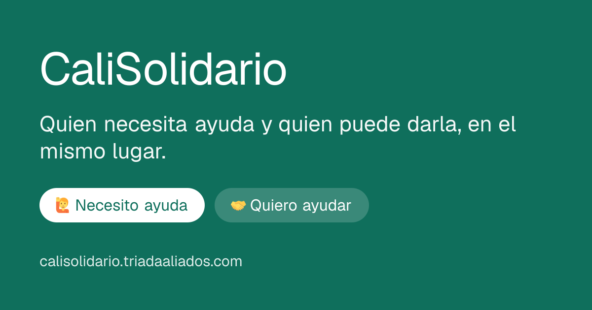

<div align="center">



# CaliSolidario

**Después del terremoto, la ayuda existía. Lo que faltaba era que se encontrara.**

[](https://github.com/JuanAndresCano/CaliSolidario/actions/workflows/ci.yml)
[](https://calisolidario.triadaaliados.com)

[Ver el sitio](https://calisolidario.triadaaliados.com) ·
[Decisiones de arquitectura](#decisiones-de-arquitectura) ·
[Revisión de seguridad](docs/security/revision-seguridad-2026-08-11.md)

</div>

---

## Por qué existe

El 10 de agosto de 2026, un sismo de magnitud 7,4 con epicentro en el Chocó
golpeó a Cali. En las horas siguientes pasaron dos cosas al mismo tiempo: miles
de personas salieron a ayudar, y miles de familias se quedaron sin nada.

El problema no era la escasez de solidaridad. Era que **no se encontraban**.
Había vecinos con agua de sobra a diez cuadras de familias sin una botella.
Grupos de amigos dando vueltas buscando dónde ser útiles mientras un barrio
entero se quedaba solo. En algunos puntos había tanta gente que no dejaban
entrar a ayudar; en otros, nadie llegaba.

CaliSolidario es un tablero abierto para cerrar esa distancia.

## Qué hace

| | |
|---|---|
| 🙋 **Pides lo que necesitas** | Agua, mercado, colchonetas, medicamentos, albergue, manos. |
| 🤝 **Ofreces lo que tienes** | Lo que puedas dar o el tiempo que puedas poner. |
| 📍 **Ves dónde llevar la ayuda** | Puntos de acopio con lo que le falta y lo que le sobra a cada uno, y zonas a las que no está llegando nadie. Con mapa. |
| ❤️ **Encuentras servicios gratuitos** | Profesionales y empresas verificados que pusieron su trabajo a disposición. |
| 📖 **Lees guías escritas por profesionales** | Primeros auxilios emocionales, duelo, cómo acompañar a los niños. |

Mirar es libre y no pide registro. Solo hace falta entrar con Google para
publicar, para ver un dato de contacto o para cerrar tu propio aviso.

## Uso real

Primeras **24 horas** de medición, del 12 al 13 de agosto de 2026:

| | |
|---|---|
| **1.355** | personas |
| **6.504** | páginas vistas |
| **84 %** | entra desde el celular (Android 48 %, iOS 36 %) |
| **91 %** | desde Colombia; el resto es diáspora buscando cómo ayudar |

Una de cada cuatro personas que entra intenta publicar algo.

La analítica se instaló dos días después del lanzamiento, así que todo el
tráfico anterior —incluidos los picos de difusión por WhatsApp— quedó sin
contar.

## Las restricciones mandaron el diseño

Esto no se construyó en condiciones de laboratorio: se construyó en dos días,
gratis, para una ciudad con la red saturada y gente en crisis. Casi cada
decisión técnica sale de ahí.

**Todo tiene que caber en el plan gratuito.** El tablero se sirve estático y se
revalida cada minuto, así que mil personas mirando producen *una* consulta a
Postgres, no mil. Por eso el layout no lee la sesión y los filtros no usan
`searchParams`: cualquiera de las dos cosas volvería dinámica la página y
tumbaría el caché. Un webhook de Supabase purga la caché al editar datos, así
que la frescura no cuesta consultas de más.

**Solo celulares, y con mala red.** Barra inferior al alcance del pulgar, todo
lo tocable de 44 px, texto que nunca baja de 15 px porque esto lo usa gente
mayor a la intemperie. El mapa vive en su propia ruta para que sus 40 KB de
JavaScript no los pague quien solo quiere leer una lista.

**Los datos personales son de gente vulnerable.** El aviso es público pero el
contacto vive en otra tabla, cerrada por RLS a quien no tenga sesión. Los
avisos individuales no se indexan: caducan a los siete días, pero la caché de
un buscador no caduca nunca, y la dirección de una familia damnificada no tiene
por qué seguir encontrable en Google dentro de dos años.

**En una emergencia la información se vuelve vieja en horas.** Un punto de
acopio puede pasar de saturado a necesitar voluntarios el mismo día. Por eso
cada sitio muestra cuándo se confirmó por última vez, y "lleno por ahora" es un
estado reversible en vez de un borrado.

## Decisiones de arquitectura

Las decisiones que costaron discusión están escritas, con su contexto y sus
consecuencias:

- [**ADR-0001** — El tablero se sirve desde caché, no desde el cliente](docs/adr/0001-tablero-publico-cacheado.md)
- [**ADR-0002** — El dato de contacto vive en su propia tabla](docs/adr/0002-contacto-en-tabla-aparte.md)
- [**ADR-0003** — La comunidad marca el conflicto; el retiro es la excepción](docs/adr/0003-moderacion-comunitaria.md)

Y una [revisión de seguridad](docs/security/revision-seguridad-2026-08-11.md)
hecha antes del lanzamiento, con diez hallazgos, sus severidades y los riesgos
aceptados de forma explícita.

## Stack

Next.js 16 (App Router) · React 19 · Tailwind v4 · Supabase (Postgres, Auth,
RLS) · Leaflet · Vercel.

Sin ORM, sin gestor de estado, sin librería de componentes. En un proyecto de
dos días, cada dependencia es algo más que puede romperse a las 2 a. m.

## Puesta en marcha

1. **Base de datos.** En Supabase → SQL Editor, ejecuta
   [`supabase/schema.sql`](supabase/schema.sql) completo, y después las
   [migraciones](supabase/migrations/) en orden numérico.

2. **Google OAuth.** En Google Cloud Console crea un OAuth client ID de tipo
   *Aplicación web* con este redirect URI:

   ```
   https://<tu-ref>.supabase.co/auth/v1/callback
   ```

   El Client ID y el secret van en Supabase → Authentication → Providers →
   Google. En URL Configuration agrega `http://localhost:3000/**` y la URL de
   producción.

3. **Variables de entorno.**

   ```bash
   cp .env.local.example .env.local
   ```

   `NEXT_PUBLIC_SUPABASE_URL` y `NEXT_PUBLIC_SUPABASE_ANON_KEY` salen de
   Supabase → Project Settings → API. La `service_role` no se usa en ninguna
   parte y no debe estar ahí.

4. **Arrancar.**

   ```bash
   nvm use 22 && npm run dev
   ```

## Flujo de trabajo

Rama única `main`, protegida. Todo cambio entra por pull request desde una rama
`feat/...`, que Vercel despliega en su propia preview para probarla antes de
fusionar.

El CI corre en cada PR: `next typegen`, `tsc --noEmit`, `eslint` y el build de
producción, cada uno como paso aparte para que el nombre del que falle diga qué
se rompió. Lo mismo en local:

```bash
bash scripts/verificar-codigo.sh
```

Opcionalmente, en Settings → Variables se pueden definir
`NEXT_PUBLIC_SUPABASE_URL` y `NEXT_PUBLIC_SUPABASE_ANON_KEY` (son públicas por
diseño) para que el CI valide además que las consultas a Supabase funcionan.

### Migraciones

La regla que más importa: **ninguna migración puede romper el código que está
desplegado en ese momento.** Primero se agrega, después se despliega el código
que lo usa, y solo entonces se quita lo viejo. Saltarse esto hace que el
rollback de Vercel restaure código viejo contra un esquema nuevo.

## Operación

Scripts para verificar el estado real en vez de adivinar:

| Script | Para qué |
|---|---|
| `verificar-codigo.sh` | Typecheck y lint antes de un commit |
| `verificar-esquema.sh` | Que RLS siga bloqueando lo que debe, con la anon key |
| `estado-migraciones.sh` | Qué migraciones están aplicadas |
| `estado-lugares.sh` | Qué sitios están cargados y en qué estado |
| `estado-tablero.sh` | Oferta contra demanda por categoría |
| `probar-webhook.sh` | Que la revalidación siga viva |
| `verificar-enlaces.sh` | Que los sitios externos a los que enlazamos respondan |

### Moderación

Las alertas de la comunidad marcan un aviso "en conflicto"; no lo retiran. El
retiro administrativo existe como último recurso en `/admin`, visible solo para
perfiles con `is_admin`:

```sql
update profiles set is_admin = true
 where id = (select id from auth.users where email = 'tu-correo@gmail.com');
```

### Caducidad

Los avisos nacen con `expires_at` a siete días. Para que salgan solos hay que
llamar a `expire_old_posts()` una vez al día, con `pg_cron` o un cron externo.

## Estructura

```
src/
  app/
    page.tsx            tablero completo (estático, revalida cada minuto)
    necesidades/        solo lo que se pide
    ofertas/            solo lo que se ofrece
    sitios/             acopios y zonas desatendidas
    mapa/               los mismos sitios, geográficos (Leaflet)
    servicios/          profesionales verificados
    guias/              contenido informativo, estático desde el repo
    aviso/[id]/         detalle; el contacto exige sesión
    publicar/           formulario + server actions
    mis-avisos/         cerrar, reabrir, borrar
    admin/              moderación (404 si no eres admin)
    api/revalidar/      purga de caché que dispara Supabase
  lib/
    supabase/public.ts  cliente anónimo, sin cookies → permite cachear
    supabase/server.ts  cliente con sesión, para acciones y páginas privadas
    supabase/browser.ts solo para el botón de Google
supabase/
  schema.sql            esquema completo para instalaciones nuevas
  migrations/           cambios incrementales, en orden
docs/
  adr/                  decisiones de arquitectura
  security/             revisión de seguridad
```

---

<div align="center">

Hecho en Cali, en dos días, porque hacía falta.

</div>
